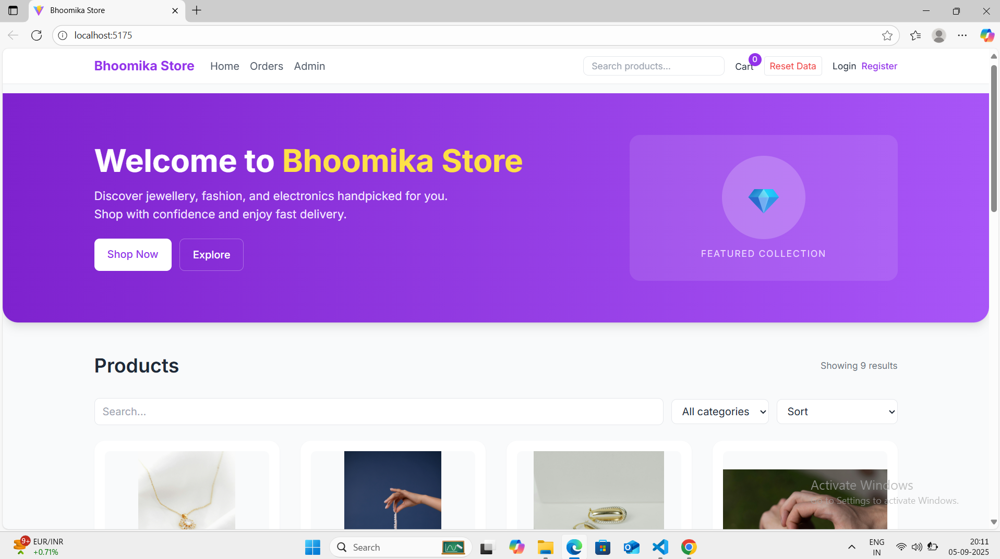
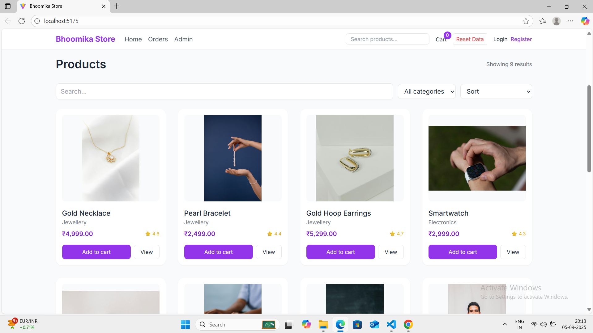
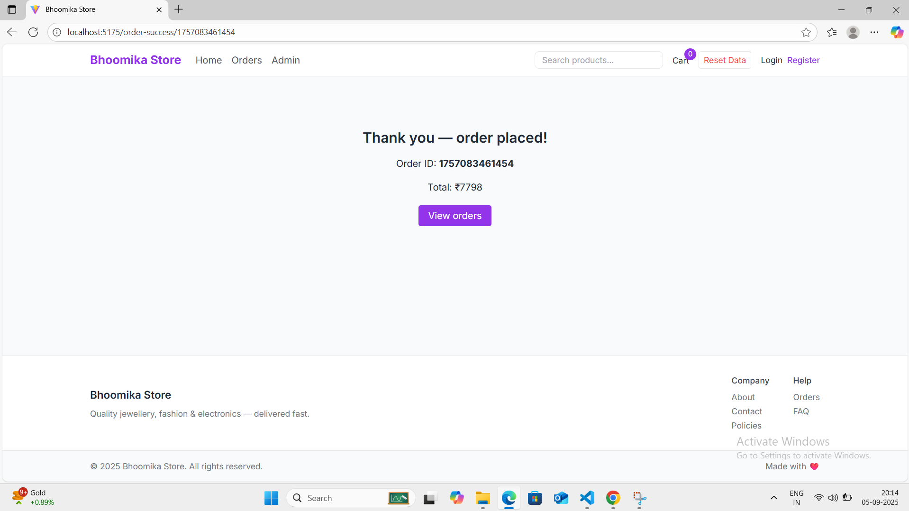

# FUTURE_FS_02

## 📌 Project: Bhoomika Store (Task 2)

A mini e-commerce application built with **React, Vite, and Tailwind CSS** as part of **Future Interns Task 2**.

### ✨ Features
- 🛍️ Product listing with categories & sorting  
- 🖼️ Product images with details  
- 🛒 Cart management  
- ✅ Checkout & Order success flow  
- 🔄 Reset Data (clear localStorage in one click)  
- 📱 Responsive design with Tailwind CSS  

---

## 📷 Screenshots

### 🏠 Home Page


### 📦 Products Page


### 🎉 Order Success


---

## ⚙️ Tech Stack
- **Frontend:** React, Vite  
- **Styling:** Tailwind CSS  
- **State Management:** React Context API  
- **Storage:** LocalStorage  

---

## 🚀 Getting Started

```bash
# Clone the repo
git clone https://github.com/bhoomika-muppala/FUTURE_FS_02.git

# Navigate into the project
cd FUTURE_FS_02

# Install dependencies
npm install

# Start development server
npm run dev
